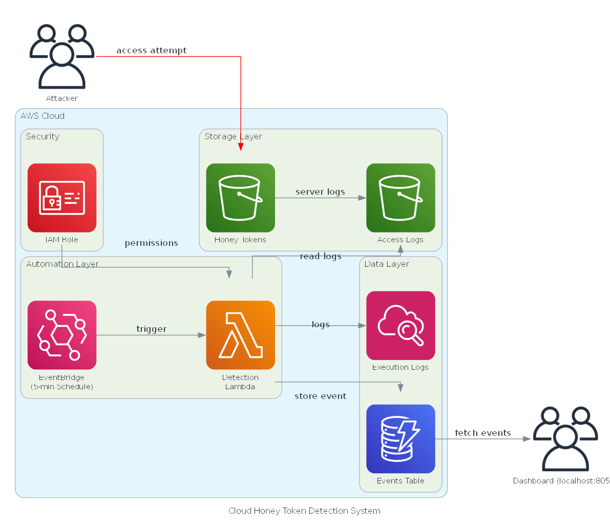

# Cloud Honey Token Detection System

## Abstract

This repository implements a serverless intrusion detection system leveraging AWS infrastructure to deploy, monitor, and analyze access patterns to strategically placed decoy assets (honey tokens). The system employs event-driven architecture combining S3 Server Access Logs, AWS Lambda functions, Amazon EventBridge scheduling, and DynamoDB for persistent storage. A real-time visualization dashboard built with Dash/Plotly provides operational visibility into detected security events.

## System Overview

### Purpose

The system addresses the challenge of detecting unauthorized access to sensitive data by deploying decoy files that mimic valuable organizational assets. Any interaction with these files constitutes a high-confidence indicator of compromise, as legitimate users have no reason to access them.

### Threat Model

The detection system targets:

- External adversaries conducting reconnaissance or data exfiltration
- Compromised credentials being used for unauthorized access
- Automated scanning and enumeration tools
- Insider threats with elevated access privileges

### Architecture



**Component Flow:**

1. **Honey Token Storage (S3):** A dedicated S3 bucket hosts decoy files including fake API keys, database backups, credentials, and configuration files.

2. **Access Logging:** S3 Server Access Logging captures all requests to the honey bucket with a delivery latency of 15-60 minutes. Logs are written to a separate logs bucket.

3. **Scheduled Analysis (EventBridge + Lambda):** An EventBridge rule triggers a Lambda function every 5 minutes to parse recent access logs and execute detection algorithms.

4. **Detection Engine (Lambda):** The Lambda function implements multiple pattern-matching algorithms to identify suspicious behaviors including bulk downloads, rapid access patterns, abnormal-hours activity, reconnaissance via user-agent analysis, and failed authentication attempts.

5. **Event Storage (DynamoDB):** Detected security events are persisted to DynamoDB with attributes including timestamp, source IP, accessed resource, detection pattern, severity level, and supporting evidence.

6. **Visualization Layer (Dash):** A local web application queries DynamoDB to render interactive visualizations including timeline charts, severity distributions, top attacker IPs, and access patterns.

7. **IAM Security Model:** A dedicated IAM role grants the Lambda function least-privilege access to read S3 logs, write to DynamoDB, and emit CloudWatch logs.

**Detection Latency:** End-to-end detection time ranges from 20-65 minutes, determined by S3 log delivery (15-60 min) plus EventBridge schedule interval (5 min).

## Detection Algorithms

The system implements five primary detection patterns with configurable thresholds:

### 1. Bulk Download Detection (Critical Severity)

**Logic:** Identifies single IP addresses requesting five or more distinct resources within a short time window.

**Rationale:** Bulk downloads indicate automated data exfiltration or reconnaissance activities.

**Threshold:** Configurable via `BULK_DOWNLOAD_THRESHOLD` (default: 10)

### 2. Rapid Access Pattern (High Severity)

**Logic:** Detects ten or more requests from the same IP within a five-minute sliding window.

**Rationale:** High-frequency access patterns suggest automated tooling or scripted enumeration.

**Threshold:** Configurable via `RAPID_ACCESS_THRESHOLD` and `RAPID_ACCESS_WINDOW`

### 3. Abnormal Hours Activity (Medium Severity)

**Logic:** Flags repeated access attempts during off-hours (00:00-06:00 UTC).

**Rationale:** After-hours access may indicate unauthorized activity or geographically distant threat actors.

**Threshold:** Configurable via `ABNORMAL_HOURS_START` and `ABNORMAL_HOURS_END`

### 4. Suspicious User-Agent Analysis (Medium Severity)

**Logic:** Pattern matching against known command-line tools and automated clients (curl, wget, python-requests, boto3, scrapers).

**Rationale:** Legitimate users typically access S3 via AWS Console or authenticated applications, not CLI tools.

### 5. Failed Access Attempts (High Severity)

**Logic:** Detects five or more HTTP 403/401/404 responses from a single IP.

**Rationale:** Multiple failures suggest credential stuffing, permission enumeration, or reconnaissance.

## Prerequisites

### Required Software

- Python 3.11 or higher
- pip (Python package manager)
- AWS CLI (optional, for credential verification)
- Git

### AWS Account Requirements

- Active AWS account with programmatic access
- IAM permissions to create and manage:
  - S3 buckets and bucket policies
  - Lambda functions and execution roles
  - DynamoDB tables
  - EventBridge rules and targets
  - CloudWatch log groups

### Recommended IAM Permissions

The deploying user requires the following managed policies or equivalent:

- `AmazonS3FullAccess` (or scoped to specific bucket operations)
- `AWSLambda_FullAccess`
- `AmazonDynamoDBFullAccess`
- `AmazonEventBridgeFullAccess`
- `IAMFullAccess` (for role creation)
- `CloudWatchLogsFullAccess`

## Installation and Configuration

### Step 1: Clone Repository

```powershell
git clone <repository-url>
cd CLOUD_COMPUTING_PROJECT
```

### Step 2: Create Python Virtual Environment (Recommended)

```powershell
python -m venv venv
.\venv\Scripts\Activate.ps1
```

### Step 3: Install Dependencies

```powershell
pip install --upgrade pip
pip install -r requirements.txt
```

**Note:** The `requirements.txt` file contains all necessary dependencies including `boto3` (AWS SDK), `dash` and `plotly` (dashboard), `cryptography` and `faker` (token generation), and supporting libraries.

### Step 4: Configure AWS Credentials

Create a `.env` file in the project root with the following variables:

```dotenv
# AWS Authentication
AWS_ACCESS_KEY_ID=<your-access-key-id>
AWS_SECRET_ACCESS_KEY=<your-secret-access-key>
AWS_REGION=us-east-1
AWS_ACCOUNT_ID=<your-12-digit-account-id>

# S3 Configuration
S3_BUCKET_NAME=honey-tokens-storage-us-east-1

# DynamoDB Configuration
DYNAMODB_TABLE_NAME=honeypot_logs

# Detection Thresholds (Optional)
BULK_DOWNLOAD_THRESHOLD=10
RAPID_ACCESS_THRESHOLD=5
RAPID_ACCESS_WINDOW=60
ABNORMAL_HOURS_START=0
ABNORMAL_HOURS_END=6

# Alert Configuration (Optional)
ALERT_EMAIL=security@yourcompany.com
SLACK_WEBHOOK_URL=<your-slack-webhook-url>

# Dashboard Configuration
DASHBOARD_PORT=8050
DASHBOARD_HOST=0.0.0.0
```

**Security Note:** Never commit the `.env` file to version control. It is included in `.gitignore`.

### Step 5: Verify AWS Connectivity

```powershell
python -c "import boto3; print(boto3.client('sts').get_caller_identity())"
```

Expected output should display your AWS account ID and user ARN.

### Step 6: Create AWS Resources

Before deploying Lambda, create the required S3 buckets and DynamoDB table:

**Create S3 Buckets:**

```powershell
aws s3 mb s3://honey-tokens-storage-us-east-1
aws s3 mb s3://honey-tokens-storage-us-east-1-logs
```

**Enable S3 Server Access Logging:**

```powershell
$loggingConfig = @"
{
  "LoggingEnabled": {
    "TargetBucket": "honey-tokens-storage-us-east-1-logs",
    "TargetPrefix": "access-logs/"
  }
}
"@

aws s3api put-bucket-logging --bucket honey-tokens-storage-us-east-1 --bucket-logging-status $loggingConfig
```

**Create DynamoDB Table:**

```powershell
aws dynamodb create-table `
  --table-name honeypot_logs `
  --attribute-definitions AttributeName=event_id,AttributeType=S `
  --key-schema AttributeName=event_id,KeyType=HASH `
  --billing-mode PAY_PER_REQUEST `
  --region us-east-1
```

**Create IAM Role for Lambda:**

```powershell
$trustPolicy = @"
{
  ""Version"": ""2012-10-17"",
  ""Statement"": [{
    ""Effect"": ""Allow"",
    ""Principal"": {""Service"": ""lambda.amazonaws.com""},
    ""Action"": ""sts:AssumeRole""
  }]
}
"@

aws iam create-role --role-name HoneyTokenLambdaRole --assume-role-policy-document $trustPolicy

aws iam attach-role-policy --role-name HoneyTokenLambdaRole --policy-arn arn:aws:iam::aws:policy/AmazonS3ReadOnlyAccess
aws iam attach-role-policy --role-name HoneyTokenLambdaRole --policy-arn arn:aws:iam::aws:policy/AmazonDynamoDBFullAccess
aws iam attach-role-policy --role-name HoneyTokenLambdaRole --policy-arn arn:aws:iam::aws:policy/CloudWatchLogsFullAccess
```

### Step 7: Generate and Upload Honey Tokens

Generate fake credentials and upload them to S3:

```powershell
python src/main.py generate-tokens
```

This creates and uploads:
- Fake API keys (AWS, Azure, GitHub, etc.)
- Fake database credentials
- Fake SSH keys
- Configuration files with secrets

## Deployment

### Automated Deployment

The `deploy_lambda_auto.py` script deploys the Lambda function and EventBridge scheduler:

```powershell
python deploy_lambda_auto.py
```

**Actions Performed:**

1. Packages `lambda_function.py` into deployment ZIP archive
2. Creates or updates Lambda function `HoneyTokenLogMonitor`
3. Configures Lambda with environment variables (S3_BUCKET_NAME, DYNAMODB_TABLE_NAME)
4. Sets Lambda timeout (60s) and memory (256 MB)
5. Creates EventBridge rule `HoneyTokenLogAnalysis` with `rate(5 minutes)` schedule
6. Grants EventBridge permission to invoke Lambda
7. Adds Lambda as target for EventBridge rule
8. Performs test invocation to verify deployment

**Prerequisites:** S3 buckets, DynamoDB table, and IAM role must exist (created in Step 6).

**Expected Output:**

```
Creating Lambda deployment package...
Deploying Lambda function...
Lambda function deployed: arn:aws:lambda:us-east-1:123456789012:function:HoneyTokenDetector
Creating EventBridge rule...
EventBridge rule created successfully
Testing Lambda function...
Lambda test successful
Deployment complete.
```

### Manual Verification Steps

1. Verify S3 buckets exist:

```powershell
aws s3 ls | Select-String "honey-tokens-storage"
```

Expected output:
```
honey-tokens-storage-us-east-1
honey-tokens-storage-us-east-1-logs
```

2. Verify DynamoDB table:

```powershell
aws dynamodb describe-table --table-name honeypot_logs
```

3. Verify Lambda function:

```powershell
aws lambda get-function --function-name HoneyTokenDetector
```

4. Verify EventBridge rule:

```powershell
aws events describe-rule --name HoneyTokenLogAnalysis
```

## Operational Use

### Starting the Dashboard

The dashboard provides real-time visualization of detected security events:

```powershell
python dashboard/app.py
```

**Expected Output:**

```
Dash is running on http://0.0.0.0:8050/

 * Serving Flask app 'app'
 * Debug mode: off
WARNING: This is a development server. Do not use it in a production deployment.
```

Access the dashboard at `http://localhost:8050`

**Dashboard Features:**

- Summary metrics (total events, unique IPs, critical/high/medium severity counts)
- Timeline chart showing event frequency over time
- Severity distribution pie chart
- Top attacker IPs (bar chart)
- Attack pattern breakdown
- Hourly access pattern heatmap
- Resource access frequency
- Recent events table with filtering

The dashboard auto-refreshes every 60 seconds.

### Generating Detection Events

After deploying the honey tokens to S3, any access to the bucket will generate detection events. You can:

1. Manually download files from the S3 bucket via AWS Console
2. Use AWS CLI to access the bucket:

```powershell
aws s3 ls s3://honey-tokens-storage-us-east-1/
aws s3 cp s3://honey-tokens-storage-us-east-1/fake-aws-key.txt .
aws s3 cp s3://honey-tokens-storage-us-east-1/fake-db-credentials.json .
```

3. Use Python boto3 to trigger bulk download pattern:

```powershell
python -c "import boto3; s3 = boto3.client('s3'); [s3.download_file('honey-tokens-storage-us-east-1', obj['Key'], obj['Key']) for obj in s3.list_objects_v2(Bucket='honey-tokens-storage-us-east-1').get('Contents', [])[:10]]"
```

**Detection Timeline:**

- S3 log delivery: 15-60 minutes
- Lambda analysis: next 5-minute interval
- Dashboard visibility: 20-65 minutes total

### Monitoring Lambda Execution

View Lambda execution logs in CloudWatch:

```powershell
aws logs tail /aws/lambda/HoneyTokenDetector --follow
```

### Querying DynamoDB Directly

```powershell
aws dynamodb scan --table-name honeypot_logs --max-items 10
```

## Repository Structure

```
CLOUD_COMPUTING_PROJECT/
├── lambda_function.py              # Core detection logic for Lambda
├── deploy_lambda_auto.py           # Automated deployment script
├── requirements.txt                # Python dependencies
├── .env.example                    # Environment variables template
├── .gitignore                      # Version control exclusions
├── README.md                       # This file
├── architecture_diagram.png        # System architecture visualization
│
├── dashboard/
│   └── app.py                      # Dash web application
│
└── src/
    ├── main.py                     # CLI entry point
    │
    ├── analysis/
    │   ├── cloudwatch_analyzer.py  # Log analysis engine
    │   ├── log_analyzer.py         # Extended pattern detectors
    │   └── pattern_detector.py     # Detection algorithm library
    │
    ├── storage/
    │   ├── s3_file_creator.py      # Honey token file generator
    │   └── file_creator.py         # Generic file creation utilities
    │
    ├── generators/
    │   ├── api_keys.py             # Fake API key generator
    │   └── ssh_keys.py             # Fake SSH key generator
    │
    └── alerts/
        ├── email_alert.py          # Email notification adapter
        └── slack_alert.py          # Slack notification adapter
```

## Troubleshooting

### Lambda Not Detecting Events

**Symptom:** Dashboard shows no events after running attack simulation.

**Diagnosis:**

1. Verify S3 Server Access Logging is enabled:

```powershell
python -c "import boto3; s3 = boto3.client('s3'); print(s3.get_bucket_logging(Bucket='honey-tokens-storage-us-east-1'))"
```

2. Check logs bucket for access log objects:

```powershell
aws s3 ls s3://honey-tokens-storage-us-east-1-logs/ --recursive
```

3. Review Lambda CloudWatch logs for parsing errors.

**Resolution:** S3 access logs have 15-60 minute delivery latency. Wait and retry.

### Dashboard Shows Connection Errors

**Symptom:** Dashboard displays database connection errors.

**Diagnosis:** Verify DynamoDB table exists and AWS credentials are valid.

**Resolution:**

```powershell
aws dynamodb describe-table --table-name honeypot_logs
python -c "import boto3; print(boto3.client('sts').get_caller_identity())"
```

### Lambda Exceeds Timeout

**Symptom:** CloudWatch logs show timeout errors after 3 seconds.

**Diagnosis:** Lambda processing too many log files or inefficient parsing.

**Resolution:** Adjust Lambda timeout and memory:

```powershell
aws lambda update-function-configuration --function-name HoneyTokenDetector --timeout 30 --memory-size 512
```

### Permission Denied Errors

**Symptom:** Lambda logs show S3 access denied or DynamoDB permission errors.

**Diagnosis:** IAM role lacks required permissions.

**Resolution:** Attach required policies to Lambda execution role:

```powershell
aws iam attach-role-policy --role-name HoneyTokenLambdaRole --policy-arn arn:aws:iam::aws:policy/AmazonS3ReadOnlyAccess
aws iam attach-role-policy --role-name HoneyTokenLambdaRole --policy-arn arn:aws:iam::aws:policy/AmazonDynamoDBFullAccess
```

## Performance Considerations

### Lambda Optimization

- **Cold Start:** First invocation may take 2-3 seconds. Subsequent invocations within 15 minutes reuse warm containers (~200ms).
- **Memory Configuration:** 256 MB sufficient for typical workloads. Increase to 512 MB if processing large log volumes.
- **Concurrent Executions:** EventBridge invokes Lambda once per schedule. No concurrency required for this workload.

### DynamoDB Capacity

- **Provisioned Mode:** 5 RCU / 5 WCU sufficient for small-scale deployments (<1000 events/hour).
- **On-Demand Mode:** Recommended for variable workloads or production deployments.

### S3 Log Retention

Configure lifecycle policies to transition logs to Glacier after 90 days and expire after 1 year:

```powershell
aws s3api put-bucket-lifecycle-configuration --bucket honey-tokens-storage-us-east-1-logs --lifecycle-configuration file://lifecycle.json
```

## References

- AWS S3 Server Access Logging: https://docs.aws.amazon.com/AmazonS3/latest/userguide/ServerLogs.html
- AWS Lambda Best Practices: https://docs.aws.amazon.com/lambda/latest/dg/best-practices.html
- DynamoDB Best Practices: https://docs.aws.amazon.com/amazondynamodb/latest/developerguide/best-practices.html

## How It Works

1. Deploy tokens to S3
2. S3 logs access (15-60 min delay)
3. Lambda checks every 5 min
4. Events stored in DynamoDB
5. Dashboard shows real-time

**Timing:** 20-65 minutes (S3: 15-60 min + Lambda: 5 min + Dashboard: 60 sec)

## Dependencies

- boto3 (AWS SDK)
- plotly (Charts)
- dash (Dashboard)
- python-dotenv
- pytz

## Security

- Never commit `.env`
- All tokens are fake
- Monitor AWS costs
